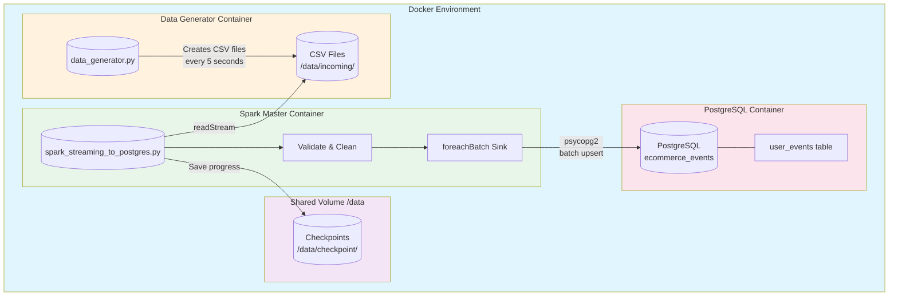
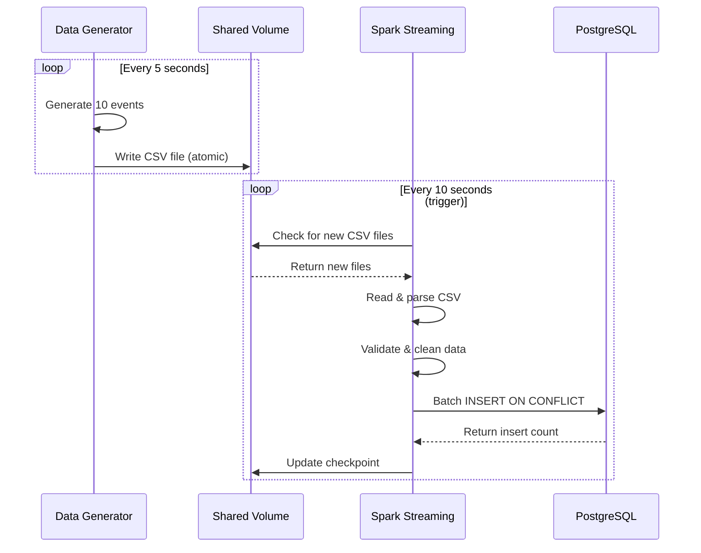
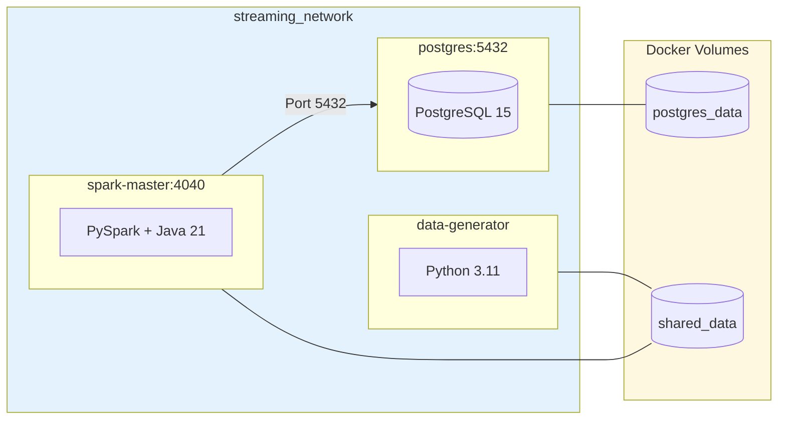
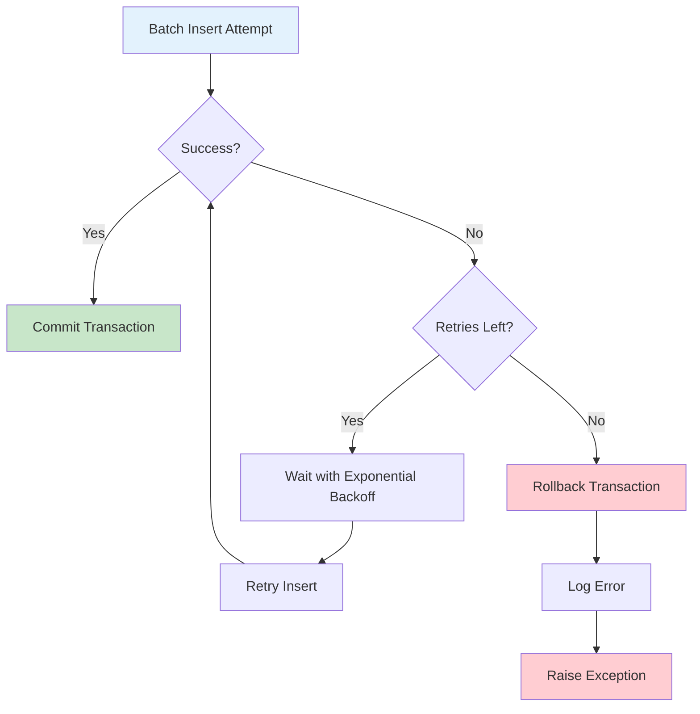

# System Architecture Diagram

## Data Flow Architecture

## Component Interaction Sequence

## Docker Container Architecture

## Data Transformation Pipeline

```mermaid
flowchart LR
    subgraph Input["Raw CSV Data"]
        A[event_id]
        B[user_id]
        C[product_id]
        D[product_name]
        E[product_category]
        F[event_type]
        G[price]
        H[event_timestamp]
    end

    subgraph Validation["Validation Rules"]
        V1["Remove NULL required fields"]
        V2["Validate event_type<br/>view or purchase"]
        V3["Validate price >= 0"]
        V4["Convert timestamp"]
        V5["Filter future timestamps"]
    end

    subgraph Output["PostgreSQL Table"]
        O1[event_id PK]
        O2[user_id]
        O3[product_id]
        O4[product_name]
        O5[product_category]
        O6[event_type]
        O7[price]
        O8[event_timestamp]
        O9[ingested_at]
    end

    Input --> Validation
    Validation --> Output

    style Input fill:#ffecb3
    style Validation fill:#c8e6c9
    style Output fill:#bbdefb
```

## Error Handling & Retry Logic

---

## How to View These Diagrams

1. **VS Code**: Install "Markdown Preview Mermaid Support" extension
2. **GitHub**: Upload this file - GitHub renders Mermaid automatically
3. **Online**: Copy the mermaid code blocks to [mermaid.live](https://mermaid.live)
4. **Export**: Use mermaid.live to export as PNG/SVG
